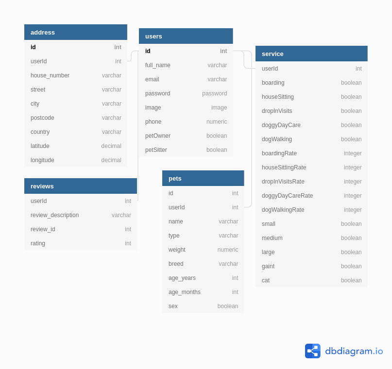

#  🐾 🐈‍ Pets Server 🐾 🐕

Pets is an application that connects pet owners with dog people who’ll treat their pets like family. You can (pet owner) select the most suitable service based on location, facilities and customer rating.You can contact pet sitters by email to ask for more details.

## Table of contents:

- **[Data base](#data-base)**
- **[Client](#client)**
- **[Technologies used](#technologies-used)**

## Data base

Diagram of data models:

## Client

**[Here](https://github.com/padmasritumati/Pets-frontend)** you can find the server repository for this project.

## Technologies used

- Express
- REST API
- PostgreSQL, Sequelize ORM
- nodemailer

